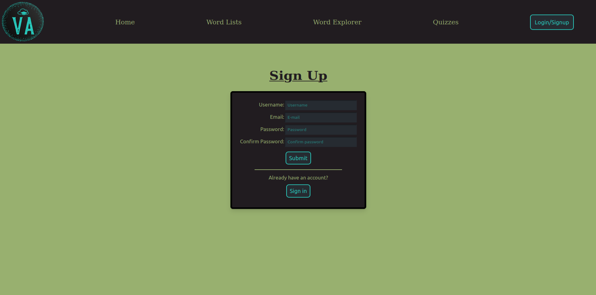
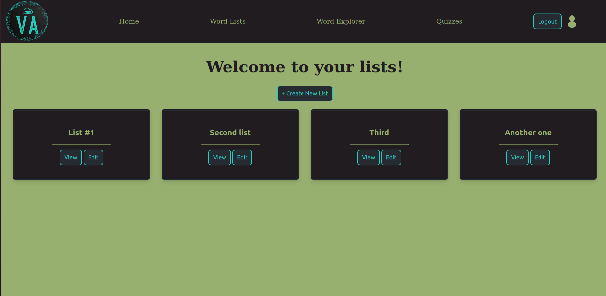
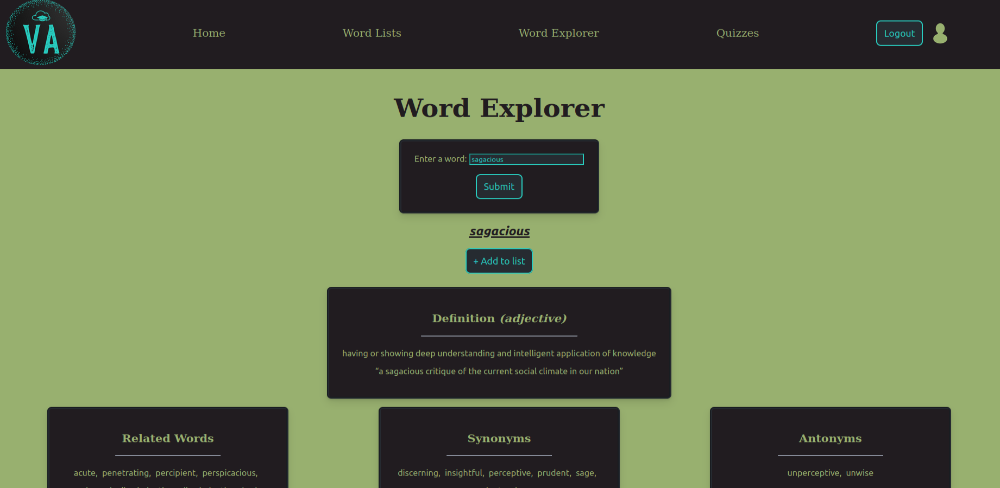
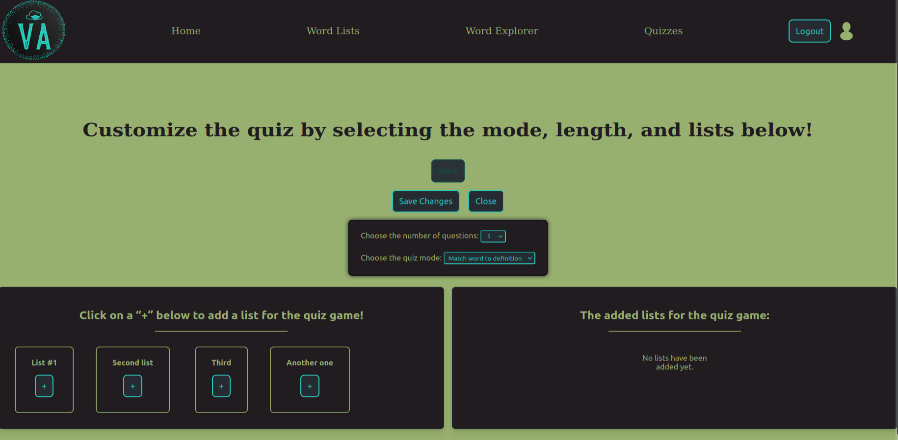
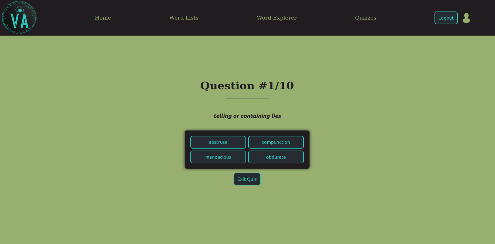
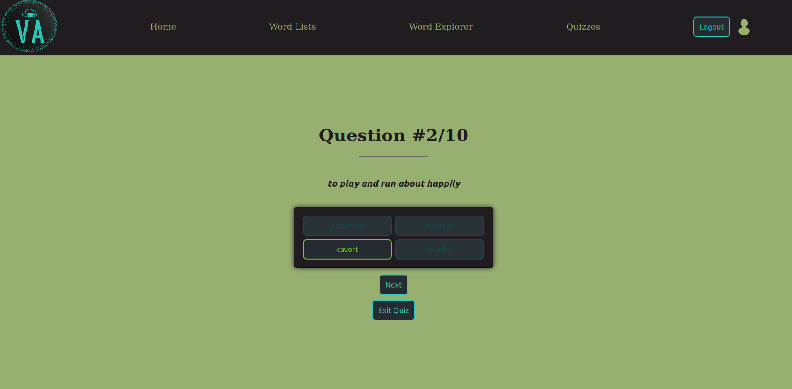
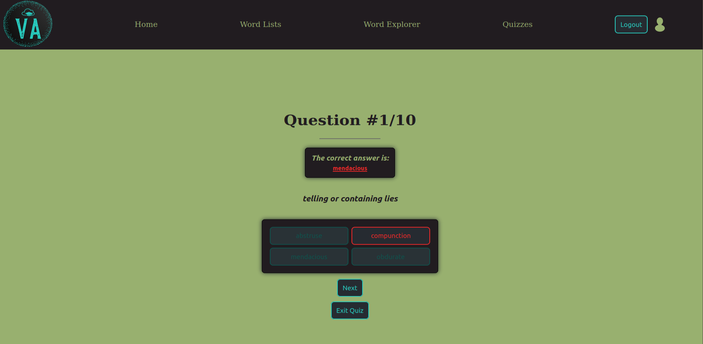

<h1 align="center">Vocabulary Augmenter</h1>

This is a vocabulary enhancement app that allows users to create word lists and then test themselves using a custom quizzing system.

  

Note: The .env file has been removed, so the code will not work properly if pulled.

<a href="https://vocabularyaugmenter.herokuapp.com/"> Click here to visit the live site. </a>

## Examples
### Sign up form
The sign up form provides real-time feedback if the user has entered information in an invalid format. It also provides a server-side response if the user attempts to create an account with an existing email (neither of which is pictured here).

  

### User's lists page
The user lists are integral to the flow of the application, as they provide the wordbank(s) for the quiz games. Users can create, view, edit, and delete their lists from this page. Currently, it only displays lists corresponding to the logged in user, but in the future I would like to have a "public" lists section as well.

  

### Word Explorer for searching and adding words
The Word Explorer allows users to query for words using the <a href="https://dictionaryapi.com/products/api-collegiate-thesaurus"> Merriam-Webster API. </a> Currently, the information displayed per query is limited to a subsection of what is provided through the API, though in the future I'd like to incorporate the rest of it. Additionally, there are no "alternative suggestions" for incorrectly spelled nor unavailable words.

  

### Quiz option selection
Here the user may choose the game mode (currently either matching the word to definition, or the reverse), as well as the number of questions and which lists they would like to include in the possible word bank.

  

### Quiz question
The questions are generated dynamically and randomly, so each quiz is made to feel unique.

  

### Quiz right answer 
A correct  answer disables the buttons and highlights what you selected.

  

### Quiz wrong answer
A wrong answer provides the correct answer and highlights what you selected.

  

